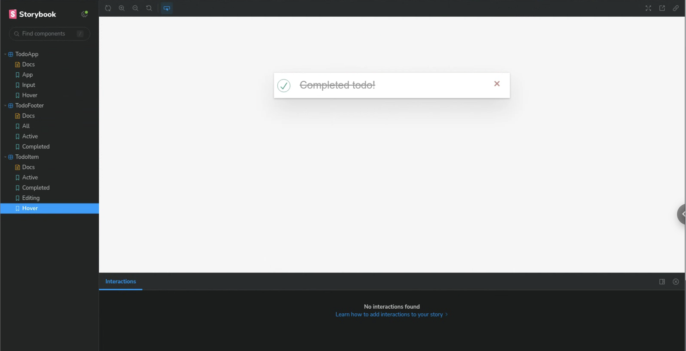

# Storybook interaction and states exploration
## Purpose
For Percy screenshot testing with Storybook, interaction events are needed to trigger user-defined states (such as hover or input). The goal of this project is to explore the interaction commands and how to use Percy in conjunction. 

To accomplish this, we can use either the [interaction add-on published by storybook](https://storybook.js.org/addons/@storybook/addon-interactions), or the [pseudo-states add-on by Chromatic](https://github.com/chromaui/storybook-addon-pseudo-states). 


## Description
### Interaction add-on
We set up an interaction event that involves two steps:
1. an input event (see all events at [storybook.js](https://storybook.js.org/docs/writing-tests/interaction-testing#api-for-user-events))
2. an assertion that the event occurred

To facilitate and explore Percy integration, we modify the class list to trigger a Percy snapshot after the interaction has completed. 

```javascript
// TodoApp.stories.js
export const Input = Template.bind({});

Input.play = async ({ canvasElement }) => {
  const canvas = within(canvasElement);
  
  const input = await canvas.getByTestId('new-todo'); 

  // 👇 Simulate interactions with the component
  await userEvent.type(input, 'ahoy!{enter}');

  // 👇 Assert DOM structure
  await expect(
    canvas.getByDisplayValue(
      'ahoy!'
    )
  ).toBeInTheDocument();
  
  input.classList.add('percy-selector-placeholder');
};

Input.parameters = {
  percy: {
    waitForSelector: '.percy-selector-placeholder'
  }
}
```

(see all selectors at [testing-library](https://testing-library.com/))

**Demo**: See Interaction.webm file 
**Percy**: https://percy.io/28cf89c9/demo-storybook 

### Pseudostates

We add a `:hover` property to a to-do task and export it as a story. We can verify in Storyboard that the hover property is active. 

```javascript
export const Hover = Template.bind({});

Hover.args = {
  ...Template.args,
  title: 'Completed todo!',
  completed: true
};

Hover.parameters = { pseudo: { hover: true } }
```
**Hovered**: 
**No hover**: 


